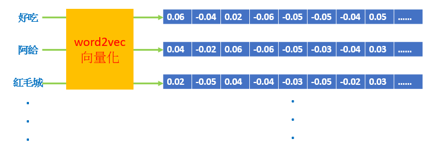

# Tourism-and-sightseeing-system
此為課程研習專題的作品，情境為淡水旅遊中心內建置的語音系統，當遊客詢問淡水地區相關問題時，系統會回覆對應的答案，此篇內容並不詳述code的寫法，主要著重在原理以及架構之上。
## 系統概述
實現的方式是以 Raspberry作為運算核心，透過麥克風收音，將音訊轉化為文字 (Speech to Text)，再藉由中文自然語言處理(NLP) ，包含Jieba中文斷詞以及刪除停用詞等處理來提高文字的識別率，再以詞向量方式將句子轉成向量(word2vector)。最後以兩兩間向量夾角的餘弦值，決定什麼樣的問題，應該要播報那一組答案(Text to Speech)。
## 流程以及各套件說明
* 語料庫的建立以及轉換向量

因為場景預設在淡水，所以語料的篩選上都是和淡水有關係的，例如好吃、阿給、紅毛城等，並去除不必要的贅詞；將這些詞彙套用到word2vec模型之中將每一個詞向量化，並建立像是向量資料庫的概念，如下圖示意：

* 語音轉文字、文字轉語音

在一開始會透過收音裝置輸入我們的問題，但是再進入主程式前必須將語音轉換成文字，系統才能夠處理；而為了更貼近人性化，除了顯示答案外，還會透過語音將答案"說"出來。前面語音轉文字用到的是 "SpeechRecognizion" 的套件，後面文字轉語音則是用 "gTTS" 的套件，兩者都是google的服務。
